# iOS Job App Backend - Complete Database Documentation

## Table of Contents
1. [Overview](#overview)
2. [Database Architecture](#database-architecture)
3. [Schema Diagrams](#schema-diagrams)
4. [Core Tables](#core-tables)
5. [Analytics Tables](#analytics-tables)
6. [Foreign Key Relationships](#foreign-key-relationships)
7. [Data Flow Diagrams](#data-flow-diagrams)
8. [Query Examples](#query-examples)
9. [Performance Considerations](#performance-considerations)
10. [Migration History](#migration-history)

## Overview

The iOS Job App Backend uses a PostgreSQL database with two main schemas:
- **`iosapp`** - Core application data and analytics
- **`scraper`** - Job data from external sources

The database follows RDBMS principles with complete referential integrity through foreign key constraints.

## Database Architecture

### Schemas Overview


### High-Level Architecture


## Schema Diagrams

### Complete Database Schema


## Core Tables

### 1. Users Table (`iosapp.users`)

**Purpose**: Central user management and preferences

| Column | Type | Constraints | Description |
|--------|------|-------------|-------------|
| `id` | UUID | PRIMARY KEY | Unique user identifier |
| `email` | VARCHAR(255) | UNIQUE, INDEX | User email address |
| `keywords` | JSONB | DEFAULT [] | Job search keywords |
| `preferred_sources` | JSONB | DEFAULT [] | Preferred job sources |
| `notifications_enabled` | BOOLEAN | DEFAULT TRUE | Notification preferences |
| `last_notified_at` | TIMESTAMP | NULL | Last notification timestamp |
| `created_at` | TIMESTAMP | DEFAULT NOW() | Account creation time |
| `updated_at` | TIMESTAMP | DEFAULT NOW() | Last update time |

**Relationships**:
- One-to-many with all analytics tables
- One-to-many with device_tokens, saved_jobs, job_views

### 2. Device Tokens Table (`iosapp.device_tokens`)

**Purpose**: iOS device registration and push notification management

| Column | Type | Constraints | Description |
|--------|------|-------------|-------------|
| `id` | UUID | PRIMARY KEY | Unique token identifier |
| `user_id` | UUID | FK to users.id | Owner of the device |
| `device_id` | VARCHAR(255) | UNIQUE | Device unique identifier |
| `device_token` | TEXT | NOT NULL | APNS device token |
| `device_info` | JSONB | DEFAULT {} | Device metadata |
| `is_active` | BOOLEAN | DEFAULT TRUE | Token validity status |
| `created_at` | TIMESTAMP | DEFAULT NOW() | Registration time |
| `updated_at` | TIMESTAMP | DEFAULT NOW() | Last update time |

### 3. Jobs Table (`scraper.jobs_jobpost`)

**Purpose**: Job listings from external sources

| Column | Type | Constraints | Description |
|--------|------|-------------|-------------|
| `id` | INTEGER | PRIMARY KEY | Unique job identifier |
| `title` | VARCHAR(500) | NOT NULL | Job title |
| `company` | VARCHAR(255) | NOT NULL | Company name |
| `description` | TEXT | NULL | Job description |
| `location` | VARCHAR(255) | NULL | Job location |
| `source` | VARCHAR(100) | NOT NULL | Data source |
| `url` | TEXT | NULL | Original job URL |
| `posted_date` | TIMESTAMP | NULL | Original posting date |
| `scraped_at` | TIMESTAMP | DEFAULT NOW() | Data collection time |
| `created_at` | TIMESTAMP | DEFAULT NOW() | Record creation |
| `updated_at` | TIMESTAMP | DEFAULT NOW() | Last modification |

## Analytics Tables

### 1. User Sessions (`iosapp.user_sessions`)

**Purpose**: Track app usage sessions with comprehensive metrics


| Column | Type | Constraints | Description |
|--------|------|-------------|-------------|
| `id` | UUID | PRIMARY KEY | Session identifier |
| `user_id` | UUID | FK to users.id, NOT NULL | Session owner |
| `device_id` | VARCHAR(255) | NOT NULL | Device identifier |
| `session_start` | TIMESTAMP | DEFAULT NOW() | Session start time |
| `session_end` | TIMESTAMP | NULL | Session end time |
| `duration_seconds` | INTEGER | CHECK >= 0 | Session duration |
| `app_version` | VARCHAR(20) | NULL | App version used |
| `os_version` | VARCHAR(20) | NULL | iOS version |
| `actions_count` | INTEGER | DEFAULT 0 | Total actions performed |
| `jobs_viewed_count` | INTEGER | DEFAULT 0 | Jobs viewed in session |
| `jobs_saved_count` | INTEGER | DEFAULT 0 | Jobs saved in session |
| `searches_performed` | INTEGER | DEFAULT 0 | Searches in session |

**Key Relationships**:
- Parent to: `search_analytics`, `user_actions`, `job_engagement`
- Enables session-based analytics and user journey tracking

### 2. Search Analytics (`iosapp.search_analytics`)

**Purpose**: Comprehensive search behavior analysis


| Column | Type | Constraints | Description |
|--------|------|-------------|-------------|
| `id` | UUID | PRIMARY KEY | Search identifier |
| `user_id` | UUID | FK to users.id, NOT NULL | User performing search |
| `session_id` | UUID | FK to user_sessions.id | Associated session |
| `search_query` | VARCHAR(500) | NOT NULL | Original search terms |
| `normalized_query` | VARCHAR(500) | NULL | Cleaned search terms |
| `results_count` | INTEGER | DEFAULT 0 | Number of results |
| `clicked_results` | INTEGER | DEFAULT 0 | Results clicked |
| `time_to_first_click` | INTEGER | NULL | Milliseconds to first click |
| `total_session_time` | INTEGER | DEFAULT 0 | Time spent on results |
| `filters_applied` | JSONB | DEFAULT {} | Search filters used |
| `result_job_ids` | JSONB | DEFAULT [] | Job IDs in results |
| `clicked_job_ids` | JSONB | DEFAULT [] | Clicked job IDs |

### 3. User Actions (`iosapp.user_actions`)

**Purpose**: Granular tracking of all user interactions


| Column | Type | Constraints | Description |
|--------|------|-------------|-------------|
| `id` | UUID | PRIMARY KEY | Action identifier |
| `user_id` | UUID | FK to users.id, NOT NULL | User performing action |
| `session_id` | UUID | FK to user_sessions.id | Session context |
| `job_id` | INTEGER | FK to jobs_jobpost.id | Related job (if any) |
| `search_id` | UUID | FK to search_analytics.id | Related search (if any) |
| `action_type` | VARCHAR(50) | NOT NULL | Type of action |
| `action_details` | JSONB | DEFAULT {} | Additional action data |
| `search_query` | VARCHAR(500) | NULL | Search query (if search action) |
| `page_url` | VARCHAR(500) | NULL | App screen/page |
| `duration_seconds` | INTEGER | DEFAULT 0 | Time spent on action |

**Action Types**:
- `view_job` - User viewed job details
- `save_job` - User saved job
- `unsave_job` - User removed saved job
- `search` - User performed search
- `apply_job` - User applied to job
- `share_job` - User shared job
- `filter_jobs` - User applied filters
- `view_company` - User viewed company details
- `update_profile` - User updated preferences
- `change_preferences` - User changed settings

### 4. Job Engagement (`iosapp.job_engagement`)

**Purpose**: Comprehensive job interaction tracking and engagement scoring


| Column | Type | Constraints | Description |
|--------|------|-------------|-------------|
| `id` | UUID | PRIMARY KEY | Engagement identifier |
| `user_id` | UUID | FK to users.id, NOT NULL | User engaging |
| `session_id` | UUID | FK to user_sessions.id | Session context |
| `job_id` | INTEGER | FK to jobs_jobpost.id, NOT NULL | Target job |
| `job_title` | VARCHAR(500) | NULL | Cached job title |
| `job_company` | VARCHAR(255) | NULL | Cached company name |
| `job_source` | VARCHAR(100) | NULL | Cached job source |
| `job_location` | VARCHAR(255) | NULL | Cached job location |
| `total_view_time` | INTEGER | DEFAULT 0 | Total viewing time (seconds) |
| `view_count` | INTEGER | DEFAULT 0 | Number of views |
| `first_viewed_at` | TIMESTAMP | NULL | First view timestamp |
| `last_viewed_at` | TIMESTAMP | NULL | Most recent view |
| `is_saved` | BOOLEAN | DEFAULT FALSE | Current save status |
| `saved_at` | TIMESTAMP | NULL | Save timestamp |
| `unsaved_at` | TIMESTAMP | NULL | Unsave timestamp |
| `applied` | BOOLEAN | DEFAULT FALSE | Application status |
| `applied_at` | TIMESTAMP | NULL | Application timestamp |
| `application_source` | VARCHAR(100) | NULL | Application method |
| `engagement_score` | INTEGER | DEFAULT 0 | Calculated score (0-100) |

**Engagement Score Calculation**:
```
Engagement Score = (view_time_factor * 0.3) + 
                  (view_count_factor * 0.2) + 
                  (save_factor * 0.25) + 
                  (apply_factor * 0.25)

Where each factor is normalized to 0-100 scale
```

### 5. User Preferences History (`iosapp.user_preferences_history`)

**Purpose**: Track changes to user preferences for analytics and rollback

| Column | Type | Constraints | Description |
|--------|------|-------------|-------------|
| `id` | UUID | PRIMARY KEY | Change identifier |
| `user_id` | UUID | FK to users.id, NOT NULL | User making change |
| `change_type` | VARCHAR(50) | NOT NULL | Type of change |
| `old_value` | JSONB | NULL | Previous value |
| `new_value` | JSONB | NULL | New value |
| `change_reason` | VARCHAR(100) | NULL | Reason for change |
| `changed_at` | TIMESTAMP | DEFAULT NOW() | Change timestamp |

### 6. Notification Analytics (`iosapp.notification_analytics`)

**Purpose**: Complete push notification lifecycle tracking


| Column | Type | Constraints | Description |
|--------|------|-------------|-------------|
| `id` | UUID | PRIMARY KEY | Notification identifier |
| `user_id` | UUID | FK to users.id, NOT NULL | Notification recipient |
| `device_token_id` | UUID | FK to device_tokens.id | Target device |
| `job_id` | INTEGER | FK to jobs_jobpost.id | Related job (if any) |
| `job_engagement_id` | UUID | FK to job_engagement.id | Related engagement |
| `notification_type` | VARCHAR(50) | NOT NULL | Notification category |
| `notification_title` | VARCHAR(200) | NULL | Notification title |
| `notification_body` | TEXT | NULL | Notification content |
| `sent_at` | TIMESTAMP | DEFAULT NOW() | Send timestamp |
| `delivered_at` | TIMESTAMP | NULL | Delivery confirmation |
| `opened_at` | TIMESTAMP | NULL | User opened notification |
| `clicked_at` | TIMESTAMP | NULL | User clicked notification |
| `delivery_status` | VARCHAR(20) | DEFAULT 'sent' | Delivery status |
| `error_message` | TEXT | NULL | Error details (if failed) |
| `led_to_app_open` | BOOLEAN | DEFAULT FALSE | Resulted in app open |
| `led_to_job_view` | BOOLEAN | DEFAULT FALSE | Resulted in job view |
| `led_to_job_save` | BOOLEAN | DEFAULT FALSE | Resulted in job save |

**Notification Types**:
- `job_match` - Matching job found
- `application_reminder` - Reminder to apply
- `weekly_digest` - Weekly job summary
- `market_insights` - Job market updates
- `system_update` - App updates

## Foreign Key Relationships

### Complete Relationship Map

```mermaid
graph TD
    subgraph "Core Tables"
        USERS[users<br/>👤 Central User Data]
        DEVICES[device_tokens<br/>📱 Device Registration]
        JOBS[jobs_jobpost<br/>💼 Job Listings]
    end
    
    subgraph "Analytics Tables"
        SESSIONS[user_sessions<br/>⏱️ App Usage Sessions]
        SEARCHES[search_analytics<br/>🔍 Search Behavior]
        ACTIONS[user_actions<br/>👆 User Interactions]
        ENGAGEMENT[job_engagement<br/>💯 Job Engagement Scoring]
        PREFERENCES[user_preferences_history<br/>⚙️ Preference Changes]
        NOTIFICATIONS[notification_analytics<br/>🔔 Push Notification Tracking]
    end
    
    %% Core relationships
    USERS -->|1:M| DEVICES
    USERS -->|1:M| SESSIONS
    USERS -->|1:M| SEARCHES
    USERS -->|1:M| ACTIONS
    USERS -->|1:M| ENGAGEMENT
    USERS -->|1:M| PREFERENCES
    USERS -->|1:M| NOTIFICATIONS
    
    %% Analytics interconnections
    SESSIONS -->|1:M| SEARCHES
    SESSIONS -->|1:M| ACTIONS
    SESSIONS -->|1:M| ENGAGEMENT
    
    SEARCHES -->|1:M| ACTIONS
    ENGAGEMENT -->|1:M| NOTIFICATIONS
    
    %% Job references
    JOBS -->|1:M| ACTIONS
    JOBS -->|1:M| ENGAGEMENT
    JOBS -->|1:M| NOTIFICATIONS
    
    %% Device references
    DEVICES -->|1:M| NOTIFICATIONS
    
    style USERS fill:#e1f5fe
    style SESSIONS fill:#f3e5f5
    style ENGAGEMENT fill:#fff3e0
```



### Detailed Foreign Key Constraints

| Child Table | Column | References | On Delete | Purpose |
|-------------|--------|------------|-----------|----------|
| **device_tokens** | user_id | users.id | CASCADE | User owns devices |
| **saved_jobs** | user_id | users.id | CASCADE | User saves jobs |
| **job_views** | user_id | users.id | CASCADE | User views jobs |
| **user_sessions** | user_id | users.id | CASCADE | User creates sessions |
| **search_analytics** | user_id | users.id | CASCADE | User performs searches |
| **search_analytics** | session_id | user_sessions.id | SET NULL | Search in session |
| **user_actions** | user_id | users.id | CASCADE | User performs actions |
| **user_actions** | session_id | user_sessions.id | SET NULL | Action in session |
| **user_actions** | job_id | jobs_jobpost.id | SET NULL | Action on job |
| **user_actions** | search_id | search_analytics.id | SET NULL | Action from search |
| **job_engagement** | user_id | users.id | CASCADE | User engages with job |
| **job_engagement** | session_id | user_sessions.id | SET NULL | Engagement in session |
| **job_engagement** | job_id | jobs_jobpost.id | CASCADE | Engagement with specific job |
| **user_preferences_history** | user_id | users.id | CASCADE | User changes preferences |
| **notification_analytics** | user_id | users.id | CASCADE | User receives notification |
| **notification_analytics** | device_token_id | device_tokens.id | SET NULL | Notification to device |
| **notification_analytics** | job_id | jobs_jobpost.id | SET NULL | Notification about job |
| **notification_analytics** | job_engagement_id | job_engagement.id | SET NULL | Notification triggered by engagement |

## Data Flow Diagrams

### User Journey Analytics Flow


### Real-time Analytics Processing


### Notification Lifecycle


## Query Examples

### 1. User Engagement Analysis

```sql
-- Get comprehensive user engagement metrics
SELECT 
    u.email,
    COUNT(DISTINCT us.id) as total_sessions,
    AVG(us.duration_seconds) as avg_session_duration,
    COUNT(DISTINCT sa.id) as total_searches,
    COUNT(DISTINCT je.job_id) as unique_jobs_engaged,
    AVG(je.engagement_score) as avg_engagement_score,
    COUNT(DISTINCT CASE WHEN je.is_saved THEN je.job_id END) as jobs_saved,
    COUNT(DISTINCT CASE WHEN je.applied THEN je.job_id END) as jobs_applied
FROM iosapp.users u
LEFT JOIN iosapp.user_sessions us ON u.id = us.user_id
LEFT JOIN iosapp.search_analytics sa ON us.id = sa.session_id
LEFT JOIN iosapp.job_engagement je ON u.id = je.user_id
WHERE u.created_at >= CURRENT_DATE - INTERVAL '30 days'
GROUP BY u.id, u.email
ORDER BY avg_engagement_score DESC;
```

### 2. Session-based Analytics

```sql
-- Analyze user behavior within sessions
SELECT 
    us.id as session_id,
    us.duration_seconds,
    us.actions_count,
    COUNT(DISTINCT sa.id) as searches_performed,
    COUNT(DISTINCT je.id) as jobs_engaged,
    COUNT(DISTINCT ua.id) as total_actions,
    AVG(je.engagement_score) as avg_job_engagement,
    CASE 
        WHEN us.duration_seconds > 600 THEN 'Long Session'
        WHEN us.duration_seconds > 180 THEN 'Medium Session'
        ELSE 'Short Session'
    END as session_type
FROM iosapp.user_sessions us
LEFT JOIN iosapp.search_analytics sa ON us.id = sa.session_id
LEFT JOIN iosapp.job_engagement je ON us.id = je.session_id
LEFT JOIN iosapp.user_actions ua ON us.id = ua.session_id
WHERE us.session_start >= CURRENT_DATE - INTERVAL '7 days'
GROUP BY us.id, us.duration_seconds, us.actions_count
ORDER BY us.session_start DESC;
```

### 3. Search Performance Analysis

```sql
-- Analyze search effectiveness and user behavior
SELECT 
    sa.search_query,
    COUNT(*) as search_frequency,
    AVG(sa.results_count) as avg_results,
    AVG(sa.clicked_results) as avg_clicks,
    AVG(sa.clicked_results::float / NULLIF(sa.results_count, 0) * 100) as click_through_rate,
    AVG(sa.time_to_first_click) as avg_time_to_click,
    COUNT(DISTINCT ua.id) as related_actions,
    COUNT(DISTINCT je.id) as resulting_engagements
FROM iosapp.search_analytics sa
LEFT JOIN iosapp.user_actions ua ON sa.id = ua.search_id
LEFT JOIN iosapp.job_engagement je ON sa.session_id = je.session_id
WHERE sa.search_timestamp >= CURRENT_DATE - INTERVAL '30 days'
GROUP BY sa.search_query
HAVING COUNT(*) >= 5
ORDER BY search_frequency DESC, click_through_rate DESC;
```

### 4. Notification Effectiveness

```sql
-- Measure notification campaign effectiveness
SELECT 
    na.notification_type,
    COUNT(*) as total_sent,
    COUNT(CASE WHEN na.delivered_at IS NOT NULL THEN 1 END) as delivered,
    COUNT(CASE WHEN na.opened_at IS NOT NULL THEN 1 END) as opened,
    COUNT(CASE WHEN na.clicked_at IS NOT NULL THEN 1 END) as clicked,
    COUNT(CASE WHEN na.led_to_app_open THEN 1 END) as app_opens,
    COUNT(CASE WHEN na.led_to_job_view THEN 1 END) as job_views,
    COUNT(CASE WHEN na.led_to_job_save THEN 1 END) as job_saves,
    
    -- Calculate rates
    ROUND(COUNT(CASE WHEN na.delivered_at IS NOT NULL THEN 1 END)::float / COUNT(*) * 100, 2) as delivery_rate,
    ROUND(COUNT(CASE WHEN na.opened_at IS NOT NULL THEN 1 END)::float / COUNT(*) * 100, 2) as open_rate,
    ROUND(COUNT(CASE WHEN na.clicked_at IS NOT NULL THEN 1 END)::float / COUNT(*) * 100, 2) as click_rate,
    ROUND(COUNT(CASE WHEN na.led_to_job_save THEN 1 END)::float / COUNT(*) * 100, 2) as conversion_rate
FROM iosapp.notification_analytics na
WHERE na.sent_at >= CURRENT_DATE - INTERVAL '30 days'
GROUP BY na.notification_type
ORDER BY conversion_rate DESC;
```

### 5. Job Engagement Scoring

```sql
-- Detailed job engagement analysis with scoring breakdown
SELECT 
    je.job_id,
    je.job_title,
    je.job_company,
    COUNT(DISTINCT je.user_id) as unique_users_engaged,
    AVG(je.total_view_time) as avg_view_time,
    AVG(je.view_count) as avg_view_count,
    COUNT(CASE WHEN je.is_saved THEN 1 END) as save_count,
    COUNT(CASE WHEN je.applied THEN 1 END) as application_count,
    AVG(je.engagement_score) as avg_engagement_score,
    
    -- Calculate engagement components
    AVG(LEAST(je.total_view_time / 60.0, 100)) as view_time_component,
    AVG(LEAST(je.view_count * 20.0, 100)) as view_count_component,
    AVG(CASE WHEN je.is_saved THEN 100 ELSE 0 END) as save_component,
    AVG(CASE WHEN je.applied THEN 100 ELSE 0 END) as apply_component
FROM iosapp.job_engagement je
WHERE je.created_at >= CURRENT_DATE - INTERVAL '30 days'
GROUP BY je.job_id, je.job_title, je.job_company
HAVING COUNT(DISTINCT je.user_id) >= 3
ORDER BY avg_engagement_score DESC;
```

## Performance Considerations

### Indexes

```sql
-- Critical indexes for analytics performance
CREATE INDEX CONCURRENTLY idx_user_sessions_user_start ON iosapp.user_sessions(user_id, session_start);
CREATE INDEX CONCURRENTLY idx_user_actions_user_timestamp ON iosapp.user_actions(user_id, timestamp);
CREATE INDEX CONCURRENTLY idx_job_engagement_user_score ON iosapp.job_engagement(user_id, engagement_score);
CREATE INDEX CONCURRENTLY idx_search_analytics_query_timestamp ON iosapp.search_analytics(search_query, search_timestamp);
CREATE INDEX CONCURRENTLY idx_notification_analytics_type_sent ON iosapp.notification_analytics(notification_type, sent_at);

-- Composite indexes for common query patterns
CREATE INDEX CONCURRENTLY idx_user_sessions_device_start ON iosapp.user_sessions(device_id, session_start);
CREATE INDEX CONCURRENTLY idx_job_engagement_job_updated ON iosapp.job_engagement(job_id, updated_at);
CREATE INDEX CONCURRENTLY idx_user_actions_session_type ON iosapp.user_actions(session_id, action_type);
```

### Materialized Views

The database includes materialized views for common analytics queries:

1. **`daily_user_stats`** - Daily aggregated user metrics
2. **`user_engagement_summary`** - Per-user engagement overview
3. **`session_analytics_comprehensive`** - Detailed session analytics

These views are refreshed automatically via scheduled jobs or can be refreshed manually:

```sql
REFRESH MATERIALIZED VIEW iosapp.daily_user_stats;
REFRESH MATERIALIZED VIEW iosapp.user_engagement_summary;
REFRESH MATERIALIZED VIEW iosapp.session_analytics_comprehensive;
```

### Query Optimization Tips

1. **Use session-based queries** for user journey analysis
2. **Filter by date ranges** to limit data scope
3. **Use LIMIT and OFFSET** for pagination
4. **Leverage materialized views** for dashboard queries
5. **Use partial indexes** on nullable foreign keys
6. **Consider partitioning** for large analytics tables

## Migration History

### Version 1.0 - Initial Schema
- Basic user and device management
- Simple job saving functionality

### Version 2.0 - Analytics Foundation
- Added user_sessions tracking
- Basic user_actions logging
- Initial job_engagement metrics

### Version 3.0 - Comprehensive Analytics (Current)
- Complete foreign key relationships
- Advanced engagement scoring
- Comprehensive notification tracking
- Session-based analytics
- Search behavior analysis
- Performance optimization

### Version 3.1 - Schema Recreation
- Truncated and recreated all analytics tables
- Fixed RDBMS violations with proper foreign keys
- Added 15 foreign key relationships
- Eliminated standalone tables
- Added comprehensive indexes

## Schema Validation

### Foreign Key Integrity Check

```sql
-- Verify all foreign key relationships
SELECT 
    tc.constraint_name,
    tc.table_name,
    kcu.column_name,
    ccu.table_name AS foreign_table_name,
    ccu.column_name AS foreign_column_name
FROM information_schema.table_constraints AS tc 
JOIN information_schema.key_column_usage AS kcu ON tc.constraint_name = kcu.constraint_name
JOIN information_schema.constraint_column_usage AS ccu ON ccu.constraint_name = tc.constraint_name
WHERE tc.constraint_type = 'FOREIGN KEY' 
AND tc.table_schema = 'iosapp'
ORDER BY tc.table_name, tc.constraint_name;
```

### Data Consistency Validation

```sql
-- Check for orphaned records (should return 0 for all)
SELECT 'user_sessions orphaned' as check_type, COUNT(*) as orphaned_count
FROM iosapp.user_sessions us
LEFT JOIN iosapp.users u ON us.user_id = u.id
WHERE u.id IS NULL

UNION ALL

SELECT 'search_analytics orphaned sessions', COUNT(*)
FROM iosapp.search_analytics sa
LEFT JOIN iosapp.user_sessions us ON sa.session_id = us.id
WHERE sa.session_id IS NOT NULL AND us.id IS NULL

UNION ALL

SELECT 'job_engagement orphaned jobs', COUNT(*)
FROM iosapp.job_engagement je
LEFT JOIN scraper.jobs_jobpost j ON je.job_id = j.id
WHERE j.id IS NULL;
```

---

**Last Updated**: 2025-07-02  
**Database Version**: 3.1  
**Schema Status**: ✅ All foreign key relationships implemented  
**Total Tables**: 12 (6 core + 6 analytics)  
**Total Foreign Keys**: 15  
**RDBMS Compliance**: ✅ Complete referential integrity