# Database Quick Reference Guide

## Table Overview

```mermaid
mindmap
  root)iOS Job App Database(
    Core Tables
      users
        📧 email (unique)
        🔧 preferences
        📅 timestamps
      device_tokens
        📱 device_id
        🔔 push_token
        ℹ️ device_info
      jobs_jobpost
        💼 job_data
        🏢 company_info
        📍 location
    Analytics
      user_sessions
        ⏱️ session_tracking
        📊 activity_metrics
        📱 app_version
      search_analytics
        🔍 search_queries
        📈 results_metrics
        👆 click_tracking
      user_actions
        👆 all_interactions
        🎯 action_types
        ⏰ timing_data
      job_engagement
        💯 engagement_score
        👀 view_metrics
        💾 save_status
      notification_analytics
        🔔 push_lifecycle
        📊 delivery_metrics
        🎯 conversion_tracking
```



## Foreign Key Relationships Summary

| Table | Total FKs | Key Relationships |
|-------|-----------|-------------------|
| **user_sessions** | 1 | → users |
| **search_analytics** | 2 | → users, sessions |
| **user_actions** | 4 | → users, sessions, jobs, searches |
| **job_engagement** | 3 | → users, sessions, jobs |
| **user_preferences_history** | 1 | → users |
| **notification_analytics** | 4 | → users, devices, jobs, engagements |

## Most Important Queries

### 1. Get User Activity Summary
```sql
SELECT u.email, COUNT(us.id) as sessions, AVG(je.engagement_score) as avg_engagement
FROM users u
LEFT JOIN user_sessions us ON u.id = us.user_id  
LEFT JOIN job_engagement je ON u.id = je.user_id
GROUP BY u.id, u.email;
```

### 2. Session Analytics
```sql
SELECT session_id, duration_seconds, COUNT(ua.id) as actions, COUNT(DISTINCT sa.id) as searches
FROM user_sessions us
LEFT JOIN user_actions ua ON us.id = ua.session_id
LEFT JOIN search_analytics sa ON us.id = sa.session_id
GROUP BY session_id, duration_seconds;
```

### 3. Job Engagement Metrics
```sql
SELECT job_id, job_title, COUNT(*) as users_engaged, AVG(engagement_score) as avg_score
FROM job_engagement 
GROUP BY job_id, job_title
ORDER BY avg_score DESC;
```

## Action Types Reference

| Action Type | Description | Links To |
|-------------|-------------|----------|
| `view_job` | User viewed job details | job_id, session_id |
| `save_job` | User saved job | job_id, session_id |
| `search` | User performed search | search_id, session_id |
| `apply_job` | User applied to job | job_id, session_id |
| `share_job` | User shared job | job_id, session_id |

## Engagement Score Formula

```
Engagement Score = (view_time * 0.3) + (view_count * 0.2) + (saved * 0.25) + (applied * 0.25)
Scale: 0-100 points
```

## Key Indexes

- `user_sessions(user_id, session_start)` - User session history
- `user_actions(user_id, timestamp)` - User activity timeline  
- `job_engagement(job_id, engagement_score)` - Popular jobs
- `search_analytics(search_query, search_timestamp)` - Search trends
- `notification_analytics(notification_type, sent_at)` - Campaign metrics

## Common Analytics Patterns

### User Journey Analysis
```
user → session → (search → action) | (job_view → engagement) → notification
```

### Engagement Funnel
```
job_view → extended_viewing → save_job → apply_job
```

### Notification Campaign
```
trigger → send → deliver → open → click → convert
```