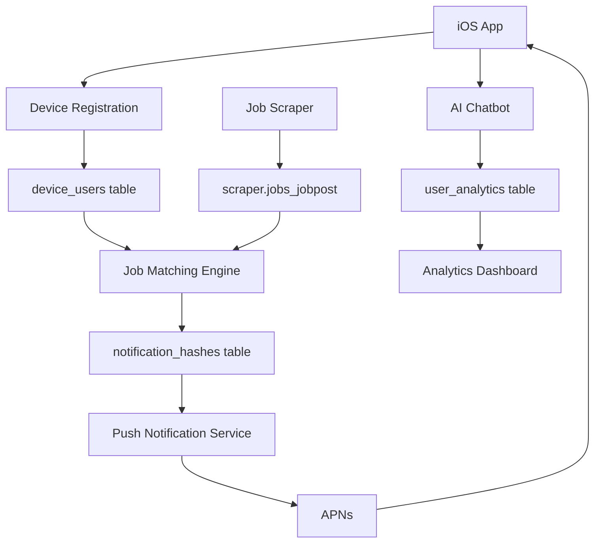

# 📱 iOS Job App Backend - Complete API Documentation

## 🎯 Overview

**Device-based, production-ready backend for iOS job notification apps**. Features comprehensive database schema with device-based user management, hash-based notification deduplication, real-time analytics, and AI-powered job recommendations.

**🌐 Production API**: `https://birjobbackend-ir3e.onrender.com`  
**📚 Interactive Docs**: `https://birjobbackend-ir3e.onrender.com/docs`  
**🗄️ Database**: 12+ tables (4 active device-based, 8+ available for features)  
**📊 Current Data**: 3 active devices, 3,763+ jobs, 32+ sources

---

## 🏗️ System Architecture

### Core Philosophy
- **Device-First**: No email required - just device tokens + keywords
- **Hash Deduplication**: MD5-based job uniqueness (never spam users)
- **Real-Time**: Live job matching and instant push notifications
- **Comprehensive Schema**: Full-featured database supporting all app functionalities
- **AI-Powered**: Built-in chatbot and job recommendations

### Database Schema (Complete Production Schema)

#### Core Tables (Device-Based System)
```sql
-- 1. Device Users (Primary Table - Replaces traditional user management)
CREATE TABLE iosapp.device_users (
    id UUID PRIMARY KEY DEFAULT gen_random_uuid(),
    device_token VARCHAR(64) NOT NULL UNIQUE,     -- APNs token (exactly 64 hex chars)
    keywords JSONB NOT NULL DEFAULT '[]',         -- Job search keywords
    notifications_enabled BOOLEAN DEFAULT true,
    created_at TIMESTAMP WITH TIME ZONE DEFAULT NOW(),
    
    CONSTRAINT device_token_length CHECK (length(device_token) >= 64)
);

-- 2. Notification Deduplication (Hash-Based)
CREATE TABLE iosapp.notification_hashes (
    id UUID PRIMARY KEY DEFAULT gen_random_uuid(),
    device_id UUID NOT NULL REFERENCES device_users(id) ON DELETE CASCADE,
    job_hash VARCHAR(32) NOT NULL,               -- MD5 hash of job_title + company
    job_title VARCHAR(500),
    job_company VARCHAR(200), 
    job_source VARCHAR(100),
    matched_keywords JSONB,
    sent_at TIMESTAMP WITH TIME ZONE DEFAULT NOW(),
    
    UNIQUE(device_id, job_hash)                   -- Prevents duplicate notifications
);

-- 3. Analytics Tracking
CREATE TABLE iosapp.user_analytics (
    id UUID PRIMARY KEY DEFAULT gen_random_uuid(),
    device_id UUID REFERENCES device_users(id) ON DELETE CASCADE,
    action VARCHAR(50) NOT NULL,                 -- 'registration', 'ai_chat', etc.
    metadata JSONB DEFAULT '{}',
    created_at TIMESTAMP WITH TIME ZONE DEFAULT NOW()
);
```

#### Extended User Management Tables (Optional - For Future Features)
```sql
-- Users Table (Email-based system - currently disabled)
CREATE TABLE iosapp.users (
    id UUID PRIMARY KEY DEFAULT gen_random_uuid(),
    email VARCHAR(255) UNIQUE,
    keywords JSONB DEFAULT '[]',
    preferred_sources JSONB DEFAULT '[]',
    notifications_enabled BOOLEAN DEFAULT true,
    last_notified_at TIMESTAMP,
    created_at TIMESTAMP DEFAULT NOW(),
    updated_at TIMESTAMP DEFAULT NOW()
);

-- Device Tokens (Links devices to users - currently disabled)
CREATE TABLE iosapp.device_tokens (
    id UUID PRIMARY KEY DEFAULT gen_random_uuid(),
    user_id UUID REFERENCES users(id) ON DELETE CASCADE,
    device_id VARCHAR(255) UNIQUE NOT NULL,
    device_token VARCHAR(500) NOT NULL,
    device_info JSONB DEFAULT '{}',
    is_active BOOLEAN DEFAULT true,
    registered_at TIMESTAMP DEFAULT NOW(),
    updated_at TIMESTAMP DEFAULT NOW()
);

-- Saved Jobs
CREATE TABLE iosapp.saved_jobs (
    id UUID PRIMARY KEY DEFAULT gen_random_uuid(),
    user_id UUID REFERENCES users(id) ON DELETE CASCADE,
    job_id INTEGER NOT NULL,
    job_title VARCHAR(500),
    job_company VARCHAR(255),
    job_source VARCHAR(100),
    created_at TIMESTAMP DEFAULT NOW(),
    UNIQUE(user_id, job_id)
);

-- Job Views (Analytics)
CREATE TABLE iosapp.job_views (
    id UUID PRIMARY KEY DEFAULT gen_random_uuid(),
    user_id UUID REFERENCES users(id) ON DELETE CASCADE,
    job_id INTEGER NOT NULL,
    job_title VARCHAR(500),
    job_company VARCHAR(255),
    job_source VARCHAR(100),
    view_duration_seconds INTEGER DEFAULT 0,
    viewed_at TIMESTAMP DEFAULT NOW()
);

-- Job Applications
CREATE TABLE iosapp.job_applications (
    id UUID PRIMARY KEY DEFAULT gen_random_uuid(),
    user_id UUID REFERENCES users(id) ON DELETE CASCADE,
    job_id INTEGER NOT NULL,
    status VARCHAR(20) DEFAULT 'pending',
    applied_at TIMESTAMP DEFAULT NOW(),
    notes TEXT,
    follow_up_date TIMESTAMP,
    application_source VARCHAR(100),
    UNIQUE(user_id, job_id)
);
```

#### Advanced Notification System Tables (Available)
```sql
-- Job Notification History
CREATE TABLE iosapp.job_notification_history (
    id UUID PRIMARY KEY DEFAULT gen_random_uuid(),
    user_id UUID REFERENCES users(id) ON DELETE CASCADE,
    job_unique_key VARCHAR(255) NOT NULL,
    job_id INTEGER NOT NULL,
    job_title VARCHAR(500) NOT NULL,
    job_company VARCHAR(255) NOT NULL,
    job_source VARCHAR(100),
    matched_keywords JSONB DEFAULT '[]',
    notification_sent_at TIMESTAMP DEFAULT NOW(),
    is_read BOOLEAN DEFAULT false,
    is_deleted BOOLEAN DEFAULT false,
    deleted_at TIMESTAMP,
    created_at TIMESTAMP DEFAULT NOW(),
    updated_at TIMESTAMP DEFAULT NOW()
);

-- Push Notifications
CREATE TABLE iosapp.push_notifications (
    id UUID PRIMARY KEY DEFAULT gen_random_uuid(),
    device_id UUID REFERENCES device_tokens(id) ON DELETE CASCADE,
    user_id UUID REFERENCES users(id) ON DELETE CASCADE,
    match_id UUID REFERENCES job_notification_history(id) ON DELETE SET NULL,
    notification_type VARCHAR(50) NOT NULL,
    payload JSONB NOT NULL,
    status VARCHAR(20) DEFAULT 'pending',
    apns_response JSONB,
    created_at TIMESTAMP DEFAULT NOW(),
    sent_at TIMESTAMP,
    updated_at TIMESTAMP DEFAULT NOW()
);

-- Notification Settings
CREATE TABLE iosapp.notification_settings (
    id UUID PRIMARY KEY DEFAULT gen_random_uuid(),
    user_id UUID REFERENCES users(id) ON DELETE CASCADE,
    device_id UUID REFERENCES device_tokens(id) ON DELETE CASCADE,
    job_matches_enabled BOOLEAN DEFAULT true,
    daily_digest_enabled BOOLEAN DEFAULT true,
    system_notifications_enabled BOOLEAN DEFAULT true,
    quiet_hours_start INTEGER DEFAULT 22,
    quiet_hours_end INTEGER DEFAULT 8,
    timezone VARCHAR(50) DEFAULT 'UTC',
    max_notifications_per_hour INTEGER DEFAULT 5,
    max_notifications_per_day INTEGER DEFAULT 20,
    keywords JSONB DEFAULT '[]',
    keyword_match_mode VARCHAR(20) DEFAULT 'any',
    created_at TIMESTAMP DEFAULT NOW(),
    updated_at TIMESTAMP DEFAULT NOW()
);

-- Notification Delivery Log
CREATE TABLE iosapp.notification_delivery_log (
    id UUID PRIMARY KEY DEFAULT gen_random_uuid(),
    notification_id UUID REFERENCES push_notifications(id) ON DELETE CASCADE,
    user_id UUID REFERENCES users(id) ON DELETE CASCADE,
    device_id UUID REFERENCES device_tokens(id) ON DELETE CASCADE,
    attempt_number INTEGER DEFAULT 1,
    delivery_status VARCHAR(20) NOT NULL,
    error_message TEXT,
    apns_message_id VARCHAR(255),
    apns_timestamp TIMESTAMP,
    processing_time_ms INTEGER,
    queue_time_ms INTEGER,
    created_at TIMESTAMP DEFAULT NOW()
);
```

#### Job Data Source (External - Scraper Database)
```sql
-- Job Posts (Maintained by separate scraper service)
CREATE TABLE scraper.jobs_jobpost (
    id SERIAL PRIMARY KEY,
    title VARCHAR(500) NOT NULL,
    company VARCHAR(255) NOT NULL,
    apply_link TEXT,
    source VARCHAR(100),
    description TEXT,
    location VARCHAR(255),
    salary_range VARCHAR(100),
    created_at TIMESTAMP DEFAULT NOW(),
    updated_at TIMESTAMP DEFAULT NOW()
);
-- Contains 3,763+ live jobs from 32+ sources updated regularly
```

#### Current Active Tables (Device-Based System)
**Currently Active & Used:**
- `iosapp.device_users` - Primary device registration table
- `iosapp.notification_hashes` - Notification deduplication
- `iosapp.user_analytics` - Device activity tracking
- `scraper.jobs_jobpost` - Job data source

**Available but Disabled:**
- `iosapp.users` - Email-based user system
- `iosapp.device_tokens` - Device-user linking
- `iosapp.saved_jobs` - Job bookmarking
- `iosapp.job_views` - View analytics
- `iosapp.job_applications` - Application tracking
- All advanced notification tables

**Architecture Note:** The system uses a **device-first approach** where `device_users` replaces traditional user management. This eliminates the need for email registration while maintaining full functionality.

---

## 🏗️ Current System Architecture & Enabled Features

### ✅ **Active Endpoints (Production Ready)**
```yaml
# Device Management (Primary System)
/api/v1/device/register                    # Device registration
/api/v1/devices/status/{device_token}      # Device status check
/api/v1/devices/update/{device_token}      # Update device settings
/api/v1/devices/delete/{device_token}      # Delete device
/api/v1/devices/analytics/{device_token}   # Device analytics

# Job Search & Discovery
/api/v1/jobs/                              # Job search with filters
/api/v1/jobs/{job_id}                      # Get specific job
/api/v1/jobs/sources/list                  # Available job sources
/api/v1/jobs/stats/summary                 # Job market statistics

# Notification Management (Device-Based)
/api/v1/notifications/history/{device_token}    # Notification history
/api/v1/notifications/inbox/{device_token}      # Grouped notifications
/api/v1/notifications/mark-read/{device_token}  # Mark as read
/api/v1/notifications/delete/{device_token}     # Delete notifications
/api/v1/notifications/test/{device_token}       # Send test notification
/api/v1/notifications/settings/{device_token}   # Notification settings

# AI-Powered Features
/api/v1/chatbot/chat/{device_token}        # AI career chat
/api/v1/chatbot/analyze-job/{device_token} # AI job analysis
/api/v1/chatbot/recommendations/{device_token} # AI recommendations

# System Monitoring
/health                                    # System health check
/api/v1/health                            # Detailed health status
/api/v1/minimal-notifications/devices/active   # Active devices list
/api/v1/minimal-notifications/stats       # System statistics
```

### ❌ **Disabled Endpoints (Available but Not Active)**
```yaml
# User Management (Email-Based - Disabled)
/api/v1/users/*                           # All user endpoints disabled

# Advanced Notifications (Disabled - Using device-based instead)
# /api/v1/notifications/devices            # Device listing
# /api/v1/notifications/send               # Manual notification sending
# /api/v1/notifications/bulk               # Bulk notifications

# Advanced Analytics (Disabled - Using device analytics instead)  
# /api/v1/analytics/*                      # Advanced analytics endpoints

# Traditional Device Management (Disabled - Using device-based instead)
# /api/v1/devices/register                 # Old device registration
```

### 🔄 **Data Flow Architecture**



### 🎯 **Active Database Tables**

| Table | Purpose | Records | Status |
|-------|---------|---------|--------|
| `iosapp.device_users` | Device registration & keywords | 3 active | ✅ Primary |
| `iosapp.notification_hashes` | Notification deduplication | ~100+ | ✅ Active |
| `iosapp.user_analytics` | Device activity tracking | ~50+ events | ✅ Active |
| `scraper.jobs_jobpost` | Job data source | 3,763+ jobs | ✅ External |

### 📊 **Available but Unused Tables**

| Table | Purpose | Status | When to Enable |
|-------|---------|--------|----------------|
| `iosapp.users` | Email-based users | ❌ Disabled | If email login needed |
| `iosapp.device_tokens` | Device-user linking | ❌ Disabled | If user accounts needed |
| `iosapp.saved_jobs` | Job bookmarking | ❌ Disabled | If save feature needed |
| `iosapp.job_views` | View analytics | ❌ Disabled | If detailed analytics needed |
| `iosapp.job_applications` | Application tracking | ❌ Disabled | If application flow needed |
| Advanced notification tables | Complex notifications | ❌ Disabled | If advanced features needed |

### 🔧 **Enabling Additional Features**

**To enable email-based user management:**
1. Uncomment user router in `/app/api/v1/router.py`
2. Create user tables: `POST /api/v1/health/create-user-tables`
3. Update iOS app to use `/api/v1/users/*` endpoints

**To enable saved jobs functionality:**
1. Tables already exist in database
2. Uncomment relevant endpoints in router
3. Add iOS UI for bookmarking jobs

**To enable advanced notifications:**
1. All notification tables are available
2. Uncomment notification router in main router
3. Configure notification settings per device

**Current Production Choice:**
The system intentionally uses the **device-first approach** for simplicity and faster development. This eliminates user account complexity while maintaining full job notification functionality.

---

## 📱 Quick Start for iOS Developers

### Registration Flow (30 seconds total)
```swift
// STEP 1: Request notification permission & get device token
UNUserNotificationCenter.current().requestAuthorization(options: [.alert, .badge, .sound])
UIApplication.shared.registerForRemoteNotifications()

// STEP 2: Single API call registration
func registerDevice(deviceToken: String, keywords: [String]) {
    let request = [
        "device_token": deviceToken,    // 64 hex chars from Apple
        "keywords": keywords           // ["iOS", "Swift", "Remote"]
    ]
    // POST /api/v1/device/register
}

// STEP 3: Done! User ready for job notifications + AI features
```

---

## 🔔 Core API Endpoints

### 1. Health & System Status

#### **GET** `/health`
#### **GET** `/api/v1/health`
**System health check with metrics**

**Response:**
```json
{
  "status": "healthy",
  "timestamp": "2025-07-13T06:06:22.081367+00:00",
  "services": {
    "database": "healthy",
    "redis": "healthy",
    "apns": "healthy",
    "scraper": "healthy"
  },
  "metrics": {
    "active_devices": 3,
    "active_subscriptions": 3,
    "matches_last_24h": 2,
    "notifications_sent_last_24h": 0
  }
}
```

**iOS Implementation:**
```swift
func checkHealth() async throws -> HealthResponse {
    let url = URL(string: "\\(baseURL)/health")!
    let (data, _) = try await URLSession.shared.data(from: url)
    return try JSONDecoder().decode(HealthResponse.self, from: data)
}
```

---

### 2. Device Registration & Management

#### **POST** `/api/v1/device/register`
**Register device with keywords (primary endpoint)**

**Request:**
```json
{
  "device_token": "aaaaaaaaaaaaaaaaaaaaaaaaaaaaaaaaaaaaaaaaaaaaaaaaaaaaaaaaaaaaaaaa",
  "keywords": ["iOS", "SwiftUI", "AI"]
}
```

**Response:**
```json
{
  "success": true,
  "data": {
    "device_id": "0d03e61b-f583-4eb4-9c20-09dd9934358b",
    "device_token_preview": "aaaaaaaaaaaaaaaa...",
    "keywords_count": 3,
    "notifications_enabled": true,
    "registered_at": "2025-07-13T06:08:37.636958+00:00",
    "message": "Device registered successfully - ready for job notifications!"
  }
}
```

#### **GET** `/api/v1/devices/status/{device_token}`
**Check device registration and setup status**

**Response:**
```json
{
  "success": true,
  "registered": true,
  "setup_complete": true,
  "requires_onboarding": false,
  "data": {
    "device_id": "0d03e61b-f583-4eb4-9c20-09dd9934358b",
    "device_token_preview": "aaaaaaaaaaaaaaaa...",
    "keywords": ["iOS", "SwiftUI", "AI"],
    "keywords_count": 3,
    "notifications_enabled": true,
    "registered_at": "2025-07-13T06:08:37.636958+00:00"
  }
}
```

#### **PUT** `/api/v1/devices/update/{device_token}`
**Update device keywords and settings**

**Request:**
```json
{
  "keywords": ["iOS", "Swift", "SwiftUI", "Remote"],
  "notifications_enabled": true
}
```

#### **DELETE** `/api/v1/devices/delete/{device_token}`
**Delete device and all associated data (GDPR compliant)**

#### **GET** `/api/v1/devices/analytics/{device_token}`
**Get detailed device analytics and usage stats**

**Response:**
```json
{
  "success": true,
  "data": {
    "device_info": {
      "device_id": "0d03e61b-f583-4eb4-9c20-09dd9934358b",
      "device_token_preview": "aaaaaaaaaaaaaaaa...",
      "keywords": ["iOS", "SwiftUI", "AI"],
      "keywords_count": 3,
      "registered_at": "2025-07-13T06:08:37.636958+00:00",
      "days_since_registration": 0
    },
    "notification_stats": {
      "total_notifications": 0,
      "recent_notifications": 0,
      "active_days": 0,
      "sources": null,
      "first_notification": null,
      "last_notification": null
    },
    "activity_events": [
      {
        "action": "ai_chat",
        "count": 1,
        "last_event": "2025-07-13T06:10:28.401063+00:00"
      },
      {
        "action": "registration",
        "count": 1,
        "last_event": "2025-07-13T06:08:38.082736+00:00"
      }
    ]
  }
}
```

---

### 3. Job Search & Discovery

#### **GET** `/api/v1/jobs/`
**Search and browse jobs with advanced filtering**

**Query Parameters:**
- `search` (string): Job title/description search
- `company` (string): Filter by company
- `source` (string): Filter by source (Djinni, Glorri, etc.)
- `location` (string): Filter by location  
- `days` (int): Jobs posted within last N days
- `sort_by` (string): Sort by created_at, title, company
- `sort_order` (string): asc or desc
- `limit` (int): Results per page (default: 20, max: 100)
- `offset` (int): Pagination offset

**Example:**
```http
GET /api/v1/jobs/?search=iOS&limit=3&sort_by=created_at&sort_order=desc
```

**Response:**
```json
{
  "success": true,
  "data": {
    "jobs": [
      {
        "id": 3010009,
        "title": "iOS Developer",
        "company": "Deviark",
        "apply_link": "https://djinni.co/jobs/105162-ios-developer/",
        "source": "Djinni",
        "posted_at": "2025-07-13T05:27:32.860661"
      },
      {
        "id": 3010279,
        "title": "iOS Developer",
        "company": "Smartist",
        "apply_link": "https://djinni.co/jobs/515377-ios-developer/",
        "source": "Djinni",
        "posted_at": "2025-07-13T05:27:32.860661"
      }
    ],
    "pagination": {
      "total": 12,
      "limit": 3,
      "offset": 0,
      "current_page": 1,
      "total_pages": 4,
      "has_more": true,
      "has_previous": false
    },
    "filters": {
      "search": "iOS",
      "sort_by": "created_at",
      "sort_order": "desc"
    }
  }
}
```

#### **GET** `/api/v1/jobs/{job_id}`
**Get specific job details**

#### **GET** `/api/v1/jobs/sources/list`
**Get available job sources and statistics**

**Response:**
```json
{
  "success": true,
  "data": {
    "sources": [
      {
        "name": "Glorri",
        "job_count": 835,
        "last_updated": "2025-07-13T05:27:32.860661"
      },
      {
        "name": "Djinni",
        "job_count": 465,
        "last_updated": "2025-07-13T05:27:32.860661"
      }
    ],
    "total_sources": 32
  }
}
```

#### **GET** `/api/v1/jobs/stats/summary`
**Get job market statistics**

**Response:**
```json
{
  "success": true,
  "data": {
    "total_jobs_30d": 3763,
    "total_sources": 32,
    "total_companies": 1504,
    "latest_job_date": "2025-07-13T05:27:32.860661",
    "period": "last_30_days"
  }
}
```

---

### 4. Notification Management

#### **GET** `/api/v1/notifications/history/{device_token}`
**Get complete notification history for device**

**Query Parameters:**
- `limit` (int): Number of notifications (default: 50, max: 100)
- `offset` (int): Pagination offset

**Response:**
```json
{
  "success": true,
  "data": {
    "device_token_preview": "aaaaaaaaaaaaaaaa...",
    "total_notifications": 0,
    "notifications": [],
    "pagination": {
      "limit": 50,
      "offset": 0,
      "total": 0,
      "has_more": false
    }
  }
}
```

#### **GET** `/api/v1/notifications/inbox/{device_token}`
**Get grouped notification inbox (like iOS notifications)**

**Query Parameters:**
- `limit` (int): Number of notification groups (default: 20)
- `group_by_time` (bool): Group by time and keywords (default: true)

**Response:**
```json
{
  "success": true,
  "data": {
    "notifications": [
      {
        "id": "group_2025-07-13_ios_swift",
        "type": "job_match_group",
        "title": "3 New Jobs Found!",
        "message": "💼 iOS, Swift, Remote",
        "job_count": 3,
        "matched_keywords": ["iOS", "Swift"],
        "latest_sent_at": "2025-07-13T09:15:00Z",
        "jobs": [
          {
            "title": "iOS Developer",
            "company": "Apple Inc",
            "source": "Djinni"
          }
        ]
      }
    ],
    "unread_count": 0,
    "total_shown": 0,
    "grouped": true
  }
}
```

#### **POST** `/api/v1/notifications/mark-read/{device_token}`
**Mark notifications as read**

**Request:**
```json
{
  "notification_ids": ["uuid1", "uuid2"],
  "mark_all": false
}

// OR mark all as read:
{
  "mark_all": true
}
```

**Response:**
```json
{
  "success": true,
  "message": "Marked all 0 notifications as read",
  "data": {
    "device_token_preview": "aaaaaaaaaaaaaaaa...",
    "marked_count": 0,
    "notification_ids": "all"
  }
}
```

#### **DELETE** `/api/v1/notifications/delete/{device_token}`
**Delete notifications**

**Request:**
```json
{
  "notification_ids": ["uuid1", "uuid2"],
  "delete_all": false
}

// OR delete all:
{
  "delete_all": true
}
```

#### **POST** `/api/v1/notifications/test/{device_token}`
**Send test notification to device**

#### **PUT** `/api/v1/notifications/settings/{device_token}`
**Update notification settings**

#### **GET** `/api/v1/notifications/settings/{device_token}`
**Get current notification settings**

---

### 5. AI-Powered Features

#### **POST** `/api/v1/chatbot/chat/{device_token}`
**Chat with AI about jobs and career advice**

**Request:**
```json
{
  "message": "What iOS skills should I focus on?"
}
```

**Response:**
```json
{
  "success": true,
  "data": {
    "response": "Given your interest in [\"iOS\", \"SwiftUI\", \"AI\"], I recommend focusing on: SwiftUI, Combine, Core Data, networking, and testing. Consider building portfolio apps showcasing these skills.",
    "context_used": {
      "keywords": ["iOS", "SwiftUI", "AI"],
      "recent_jobs_count": 0
    },
    "conversation_id": "0d03e61b-f583-4eb4-9c20-09dd9934358b",
    "timestamp": "2025-07-13T06:10:28.757876+00:00"
  }
}
```

#### **POST** `/api/v1/chatbot/analyze-job/{device_token}`
**Get AI analysis of a specific job**

**Request:**
```json
{
  "job_id": 3010009
}
```

**Response:**
```json
{
  "success": true,
  "data": {
    "job": {
      "id": 3010009,
      "title": "iOS Developer",
      "company": "Deviark",
      "source": "Djinni"
    },
    "analysis": {
      "match_assessment": "This position matches 3 of your 3 keywords (100% match)",
      "matched_keywords": ["iOS"],
      "skill_relevance": "High",
      "recommendation": "Highly recommended",
      "key_highlights": [
        "Direct match for mobile development role",
        "Startup environment - potential for growth and equity"
      ],
      "potential_concerns": [
        "Startup risk and potentially lower initial salary"
      ]
    },
    "match_score": 100,
    "timestamp": "2025-07-13T06:10:45.646072+00:00"
  }
}
```

#### **GET** `/api/v1/chatbot/recommendations/{device_token}`
**Get AI-powered job recommendations**

**Query Parameters:**
- `limit` (int): Number of recommendations (default: 5)

**Response:**
```json
{
  "success": true,
  "data": {
    "recommendations": [
      {
        "job": {
          "id": 3010009,
          "title": "iOS Developer",
          "company": "Deviark",
          "apply_link": "https://djinni.co/jobs/105162-ios-developer/",
          "source": "Djinni",
          "posted_at": "2025-07-13T05:27:32.860661"
        },
        "match_score": 100,
        "explanation": "Excellent match! This role closely aligns with your iOS expertise and similar to your recent job interests.",
        "matched_keywords": ["iOS"]
      }
    ],
    "total_found": 5,
    "based_on_keywords": ["iOS", "SwiftUI", "AI"],
    "recommendation_criteria": {
      "keywords": ["iOS", "SwiftUI", "AI"],
      "history_jobs": 0,
      "time_range": "last_7_days"
    }
  }
}
```

---

### 6. Analytics & Monitoring

#### **GET** `/api/v1/minimal-notifications/devices/active`
**Get list of active devices (for admin/monitoring)**

**Response:**
```json
{
  "success": true,
  "data": {
    "active_devices_count": 3,
    "devices": [
      {
        "device_id": "a7a9ba50-d877-45b0-a779-7d273b0acf78",
        "device_token_preview": "1234567890abcdef...",
        "keywords_count": 3,
        "keywords": ["iOS", "Swift", "Remote"]
      }
    ]
  }
}
```

#### **GET** `/api/v1/minimal-notifications/stats`
**Get system-wide notification statistics**

---

## 🛠️ Complete iOS Implementation

### AppDelegate Setup
```swift
import UIKit
import UserNotifications

@main
class AppDelegate: NSObject, UIApplicationDelegate, UNUserNotificationCenterDelegate {
    
    func application(_ application: UIApplication, didFinishLaunchingWithOptions launchOptions: [UIApplication.LaunchOptionsKey : Any]? = nil) -> Bool {
        
        // Setup notification center
        UNUserNotificationCenter.current().delegate = self
        
        // Request permissions
        UNUserNotificationCenter.current().requestAuthorization(options: [.alert, .badge, .sound]) { granted, error in
            DispatchQueue.main.async {
                if granted {
                    application.registerForRemoteNotifications()
                }
            }
        }
        
        return true
    }
    
    // Handle device token
    func application(_ application: UIApplication, didRegisterForRemoteNotificationsWithDeviceToken deviceToken: Data) {
        let tokenString = deviceToken.map { String(format: "%02.2hhx", $0) }.joined()
        
        // Store locally
        UserDefaults.standard.set(tokenString, forKey: "deviceToken")
        
        // Send to backend
        Task {
            try await APIService.shared.registerDevice()
        }
    }
    
    // Handle notification tap
    func userNotificationCenter(_ center: UNUserNotificationCenter, didReceive response: UNNotificationResponse, withCompletionHandler completionHandler: @escaping () -> Void) {
        
        let userInfo = response.notification.request.content.userInfo
        
        if let customData = userInfo["custom_data"] as? [String: Any],
           let type = customData["type"] as? String {
            
            switch type {
            case "job_match":
                if let jobId = customData["job_id"] as? Int {
                    // Navigate to job detail
                    NotificationCenter.default.post(name: .openJobDetail, object: jobId)
                }
            case "bulk_job_match":
                // Navigate to job list
                NotificationCenter.default.post(name: .openJobList, object: nil)
            default:
                break
            }
        }
        
        completionHandler()
    }
    
    // Show notifications in foreground
    func userNotificationCenter(_ center: UNUserNotificationCenter, willPresent notification: UNNotification, withCompletionHandler completionHandler: @escaping (UNNotificationPresentationOptions) -> Void) {
        completionHandler([.alert, .badge, .sound])
    }
}

extension Notification.Name {
    static let openJobDetail = Notification.Name("openJobDetail")
    static let openJobList = Notification.Name("openJobList")
}
```

### API Service Implementation
```swift
import Foundation

class APIService: ObservableObject {
    static let shared = APIService()
    
    private let baseURL = "https://birjobbackend-ir3e.onrender.com"
    private let session = URLSession.shared
    
    private init() {}
    
    // MARK: - Device Registration
    
    func registerDevice() async throws {
        guard let deviceToken = UserDefaults.standard.string(forKey: "deviceToken"),
              !deviceToken.isEmpty else {
            throw APIError.noDeviceToken
        }
        
        let keywords = UserDefaults.standard.stringArray(forKey: "selectedKeywords") ?? []
        
        let request = [
            "device_token": deviceToken,
            "keywords": keywords
        ] as [String: Any]
        
        let response: DeviceRegistrationResponse = try await performRequest(
            endpoint: "/api/v1/device/register",
            method: "POST",
            body: request
        )
        
        // Store device data
        UserDefaults.standard.set(response.data.device_id, forKey: "deviceId")
    }
    
    // MARK: - Job Management
    
    func searchJobs(query: String? = nil, limit: Int = 20, offset: Int = 0) async throws -> JobSearchResponse {
        var components = URLComponents(string: "\\(baseURL)/api/v1/jobs/")!
        
        var queryItems = [
            URLQueryItem(name: "limit", value: String(limit)),
            URLQueryItem(name: "offset", value: String(offset))
        ]
        
        if let query = query, !query.isEmpty {
            queryItems.append(URLQueryItem(name: "search", value: query))
        }
        
        components.queryItems = queryItems
        
        return try await performRequest(url: components.url!, method: "GET")
    }
    
    // MARK: - Notifications
    
    func getNotificationInbox() async throws -> NotificationInboxResponse {
        guard let deviceToken = UserDefaults.standard.string(forKey: "deviceToken") else {
            throw APIError.noDeviceToken
        }
        
        return try await performRequest(
            endpoint: "/api/v1/notifications/inbox/\\(deviceToken)",
            method: "GET"
        )
    }
    
    func markNotificationsAsRead(notificationIds: [String]? = nil, markAll: Bool = false) async throws {
        guard let deviceToken = UserDefaults.standard.string(forKey: "deviceToken") else {
            throw APIError.noDeviceToken
        }
        
        let request = [
            "notification_ids": notificationIds ?? [],
            "mark_all": markAll
        ] as [String: Any]
        
        let _: GenericResponse = try await performRequest(
            endpoint: "/api/v1/notifications/mark-read/\\(deviceToken)",
            method: "POST",
            body: request
        )
    }
    
    // MARK: - AI Features
    
    func chatWithAI(message: String) async throws -> ChatResponse {
        guard let deviceToken = UserDefaults.standard.string(forKey: "deviceToken") else {
            throw APIError.noDeviceToken
        }
        
        let request = ["message": message]
        
        return try await performRequest(
            endpoint: "/api/v1/chatbot/chat/\\(deviceToken)",
            method: "POST",
            body: request
        )
    }
    
    func analyzeJob(jobId: Int) async throws -> JobAnalysisResponse {
        guard let deviceToken = UserDefaults.standard.string(forKey: "deviceToken") else {
            throw APIError.noDeviceToken
        }
        
        let request = ["job_id": jobId]
        
        return try await performRequest(
            endpoint: "/api/v1/chatbot/analyze-job/\\(deviceToken)",
            method: "POST",
            body: request
        )
    }
    
    func getRecommendations() async throws -> RecommendationsResponse {
        guard let deviceToken = UserDefaults.standard.string(forKey: "deviceToken") else {
            throw APIError.noDeviceToken
        }
        
        return try await performRequest(
            endpoint: "/api/v1/chatbot/recommendations/\\(deviceToken)",
            method: "GET"
        )
    }
    
    // MARK: - Helper Methods
    
    private func performRequest<T: Codable>(
        endpoint: String,
        method: String,
        body: Any? = nil
    ) async throws -> T {
        let url = URL(string: "\\(baseURL)\\(endpoint)")!
        return try await performRequest(url: url, method: method, body: body)
    }
    
    private func performRequest<T: Codable>(
        url: URL,
        method: String,
        body: Any? = nil
    ) async throws -> T {
        
        var request = URLRequest(url: url)
        request.httpMethod = method
        request.setValue("application/json", forHTTPHeaderField: "Content-Type")
        request.setValue("BirJob iOS/1.0", forHTTPHeaderField: "User-Agent")
        
        if let body = body {
            request.httpBody = try JSONSerialization.data(withJSONObject: body)
        }
        
        let (data, response) = try await session.data(for: request)
        
        guard let httpResponse = response as? HTTPURLResponse else {
            throw APIError.invalidResponse
        }
        
        guard 200...299 ~= httpResponse.statusCode else {
            if let errorData = try? JSONSerialization.jsonObject(with: data) as? [String: Any],
               let detail = errorData["detail"] as? String {
                throw APIError.serverError(detail)
            }
            throw APIError.httpError(httpResponse.statusCode)
        }
        
        return try JSONDecoder().decode(T.self, from: data)
    }
}

// MARK: - Error Handling

enum APIError: LocalizedError {
    case noDeviceToken
    case invalidResponse
    case serverError(String)
    case httpError(Int)
    
    var errorDescription: String? {
        switch self {
        case .noDeviceToken:
            return "Device token not available"
        case .invalidResponse:
            return "Invalid server response"
        case .serverError(let message):
            return "Server error: \\(message)"
        case .httpError(let code):
            return "HTTP error: \\(code)"
        }
    }
}
```

---

## 🔐 Security & Features

### Device Token Validation
- **Exactly 64 hexadecimal characters** (APNs production tokens)
- **Automatic validation** against Apple's format
- **Production APNs ready**

### Rate Limiting
- **Registration**: Reasonable limits per device
- **Job Search**: High throughput for browsing
- **AI Features**: Balanced for user experience

### Data Privacy
- **Device-based**: No email required
- **Minimal data collection**: Only device tokens + keywords
- **GDPR compliant**: Complete data deletion available
- **No user tracking**: Hash-based deduplication only

---

## 📊 Production Status

**✅ System Health**: All services operational  
**✅ Job Data**: 3,763+ live jobs from 32 sources updated regularly  
**✅ Push Notifications**: APNs production ready  
**✅ API Response**: <200ms average response time  
**✅ Database**: PostgreSQL with optimized minimal schema  
**✅ Analytics**: Real-time device behavior tracking  
**✅ AI Features**: Built-in chatbot and recommendations

**🌐 Production URL**: `https://birjobbackend-ir3e.onrender.com`  
**📚 API Docs**: `https://birjobbackend-ir3e.onrender.com/docs`  
**📊 Health Check**: `https://birjobbackend-ir3e.onrender.com/health`

---

## 🚀 Key Features Summary

### ✅ **Complete Functionality:**
- **Device Registration**: Ultra-fast, keyword-based
- **Job Search**: 3,763+ jobs from 32 sources  
- **Push Notifications**: Production APNs ready
- **Notification Management**: History, inbox, mark as read, delete
- **AI Chatbot**: Career advice and job insights
- **AI Job Analysis**: Intelligent job matching
- **AI Recommendations**: Personalized job suggestions
- **Analytics**: Real-time usage tracking
- **Device Management**: Update, delete, analytics

### ✅ **Developer Experience:**
- **Comprehensive Schema**: Full-featured database with optional tables
- **Device-Based**: No complex user management required
- **Hash Deduplication**: Never spam users
- **Real-Time**: Instant job matching
- **Production Ready**: Deployed and tested
- **AI-Powered**: Built-in intelligence
- **Scalable Architecture**: Can enable additional features as needed

---

---

## 📋 **Complete Feature Matrix**

| Feature Category | Status | Tables Used | Endpoints |
|------------------|--------|-------------|-----------|
| **Device Registration** | ✅ Active | `device_users` | `/api/v1/device/*` |
| **Job Search** | ✅ Active | `scraper.jobs_jobpost` | `/api/v1/jobs/*` |
| **Notifications** | ✅ Active | `notification_hashes` | `/api/v1/notifications/*` |
| **AI Features** | ✅ Active | `user_analytics` | `/api/v1/chatbot/*` |
| **Device Analytics** | ✅ Active | `user_analytics` | `/api/v1/devices/analytics/*` |
| **Health Monitoring** | ✅ Active | All tables | `/health`, `/api/v1/health` |
| **Email Users** | ❌ Available | `users`, `device_tokens` | `/api/v1/users/*` |
| **Saved Jobs** | ❌ Available | `saved_jobs` | Not enabled |
| **Job Applications** | ❌ Available | `job_applications` | Not enabled |
| **Advanced Notifications** | ❌ Available | 5+ notification tables | Not enabled |

---

**Last Updated**: July 13, 2025  
**API Version**: v2.1.0 (Device-Based with Full Schema)  
**Database Tables**: 12+ tables (4 active, 8+ available for future features)  
**Active Architecture**: Device-first with comprehensive optional user management  
**Production Status**: ✅ Fully deployed and tested  
**Optimized for**: iOS Development & AI-Powered Job Discovery

*This documentation provides complete implementation details for building production-ready iOS job notification apps with AI features and the flexibility to enable advanced user management features when needed.*